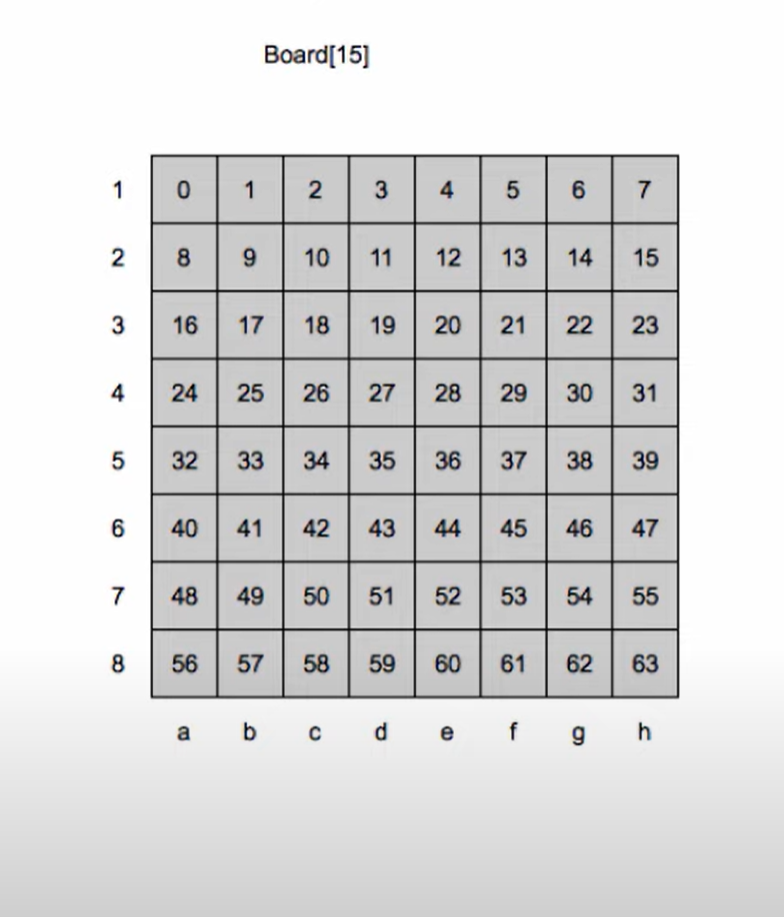

Chess Engine Project - Day 1 Log
Date: October 3, 2023

Summary:

Discussed the initial logic for the chess engine.
Decided to represent the chessboard using a 64-element array.
Planned to use variables to track the presence of white and black pieces.
Considered the strategy for handling boundaries and discussed its application for knights.
Explored alpha-beta pruning and minimax algorithms.
Details:

Board Representation:

The chessboard will be represented using a 64-element array.
Each square on the board will be mapped to an integer, ranging from 0 (a1) to 63 (h8).
We will use variables to track the presence of white and black pieces on each square.

Legal Moves:

Discussed the concept of legal moves for chess pieces.
Planned to implement logic to check for blocking pieces and adhere to the movement style of each piece.
Handling Boundaries:

Boundary Array:

It has been decided to use a boundary array to handle the board boundaries effectively.
The boundary array will consist of 120 elements to accommodate the specific needs of the chess engine.
This extended array size will allow us to implement a boundary of one line on each side and two lines at the top and bottom, which is crucial for handling knight moves and the wrapping of the board.
Knight Boundary Logic:

Knights have a unique movement pattern, which requires special boundary handling.
By extending the boundary array, we can ensure that knights can make moves even when they are near the edges of the board.
For example, after square 59, when the next square would be 60 (from right to left), our boundary array will correctly account for this movement, allowing knights to jump across the board's edges.
By implementing this boundary array with 120 elements, we'll ensure that all piece movements, especially knights, are correctly handled without encountering issues related to board boundaries.

Looked into alpha-beta pruning and minimax algorithms.
Acknowledged that these algorithms, while conceptually valuable, may need optimization for efficiency in the chess engine.
Piece Movement:

Pawn:

Pawns move forward one square but capture diagonally.
On their first move, pawns have the option to move forward two squares.
En passant and promotion rules to be implemented later.
Rook:

Rooks move horizontally or vertically any number of squares.
They cannot jump over other pieces.
Knight:

Knights move in an L-shape: two squares in one direction and one square perpendicular to that.
Knights can jump over other pieces.
Bishop:

Bishops move diagonally any number of squares.
Like rooks, they cannot jump over other pieces.
Queen:

Queens combine the movement of rooks and bishops.
They can move horizontally, vertically, or diagonally any number of squares.
King:

Kings move one square in any direction (horizontally, vertically, or diagonally).
They cannot move to a square that is under attack.
